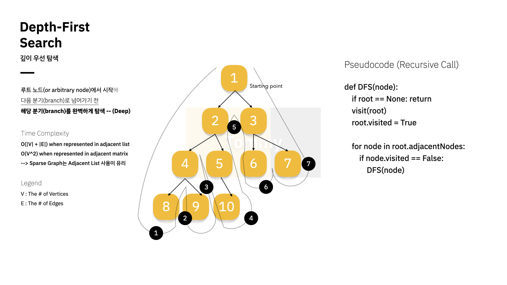
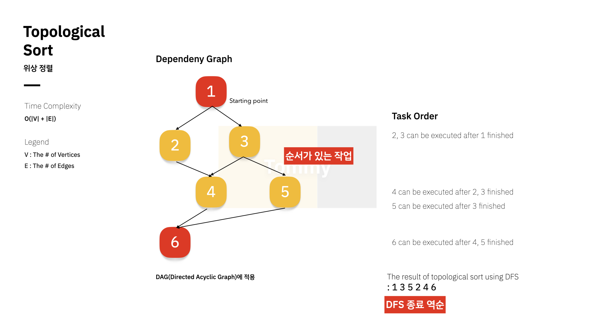

# Graph

Posted at 21-07-16

- 객체의 일부 쌍들이 연관되어 있는 객체 집합 구조
    - 정점(`Vertex`)과 간선(`Edge`)의 집합
    - 구현에는 `Adjacency Matrix` / `Adjacency List` 사용
- 그래프의 각 정점을 방문하는 그래프 순회 (Traversal) 알고리즘에 크게 `DFS` / `BFS` 로 나뉨

## DFS

> Depth-First Search, 깊이 우선 탐색

- 루트 노드 혹은 임의의 노드에서 시작해 **다음 branch로 넘어가기 전까지 현재 branch를 완벽하게 탐색**하는 방법 (Deep)
- `스택` 혹은 `Recursive Call`로 구현
- 전위 / 중위 / 후위 순회 등 트리 순회는 DFS의 한 종류
- 노드 방문 여부 확인 필요
- 검색의 `BFS` 대비 낮은 퍼포먼스



> ### Backtracking
> - 완전 탐색으로 여러 개의 솔루션을 가진 문제에서, 모든 솔루션을 탐색하는 전략
>   - 어떤 노드의 `유망함(Promising)`을 점검해 그렇지 않으면 배제(가지치기 - `Pruning`)시킨다. 해당 노드의 부모 노드로 되돌아가 다른 자식 노드를 검색한다.
>   - 제약 충족 문제 (CSP)를 풀이하는데 필수적인 알고리즘

### Time Complexity

- `Adjacency Matrix` 사용하는 경우 `O(V^2)`
- `Adjacency List` 사용하는 경우 노드 수 `V` + 간선 수 `E` 만큼의 시간복잡도 소요 `O(|V| + |E|)`

### Implementation

```python
def recursive_dfs(v, discovered=[]):
    """
    Recursive Call Version (Visiting by lexicographical order)
    """
    discovered.append(v)
    for w in graph[v]:
        if w not in discovered:
            discovered = recursive_dfs(w, discovered)
    return discovered
```

```python
def iterative_dfs(startV):
    """
    Iteration with Stack Version (Visiting by reversed order)
    """
    discovered = []
    stack = [startV]
    while stack:
        v = stack.pop()
        if v not in discovered:
            discovered.append(v)
            for w in graph[v]:
                stack.append(w)
    return discovered
```

---

## BFS

> Breadth-First Search, 너비 우선 탐색

- 루트 노드 혹은 임의의 노드에서 시작해 **인접한 노드를 우선적으로 탐색**하는 방법 (Breadth)
- `큐`를 활용해 구현
- `최단거리`를 찾는 `Dijkstra` 알고리즘 등에 사용

### Time Complexity

- `O(|V| + |E|)`

### Implementation

```python
def iterative_dfs(startV):
    discovered = [startV]
    queue = [startV]
    while queue:
        v = queue.pop(0)
        for w in graph[v]:
            if w not in discovered:
                discovered.append(w)
                queue.append(w)
    return discovered
```

---

## 그래프의 활용

- 1) 그래프의 모든 정점을 방문이 주요한 경우
- 2) 경로의 특징을 파악해야 하는 경우
- 3) 최단거리를 구해야 하는 경우

---

### Topological Sort

> 위상 정렬

DFS를 사용해 풀 수 있는 방식으로, **의존성 있는 작업이 주어질 때, 어떤 순서로 수행해야 하는지 계산하는 방법**

