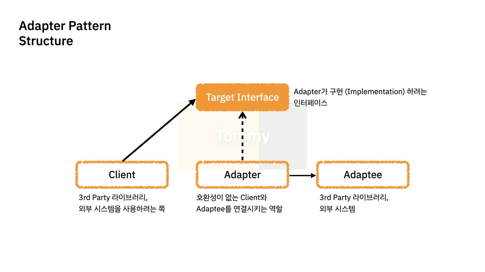
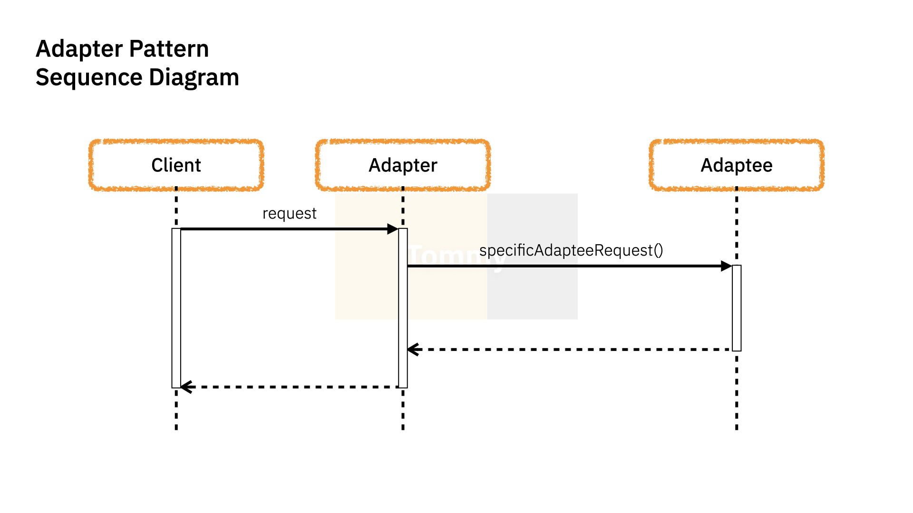

# [Design Pattern] Adapter

---

- 인터페이스 호환성 문제로 인해 같이 쓸 수 없는 클래스를 연결하는 방법을 담는 패턴.
    - 한 클래스의 인터페이스를 클라이언트에서 사용하고자 하는 **다른 인터페이스로 변환**

- 기존 시스템에 3rd-party library 추가, 레거시 인터페이스의 교체 등이 해당




## Example

```java
class Volt110 () {
    public void connect () {
        System.out.println("110V Connected!");
    }
}

class Volt220 () {
    public void connect () {
        System.out.println("220 Connected!");
    }
}

class VoltAdapter220To110 implements Volt110 {
    private Volt220 appliance;
    
    public VoltAdapter220To110(Volt220 a) {
        this.appliance = m;
    }

    @Override
    public void connect () {
        System.out.println('Successfully Converted!');
    }
}

public class Main {
    public static void main(String[] args) {
        VoltAdapter220To110 adapter = new Volt220();
        adapter.connect();
    }
}
```
