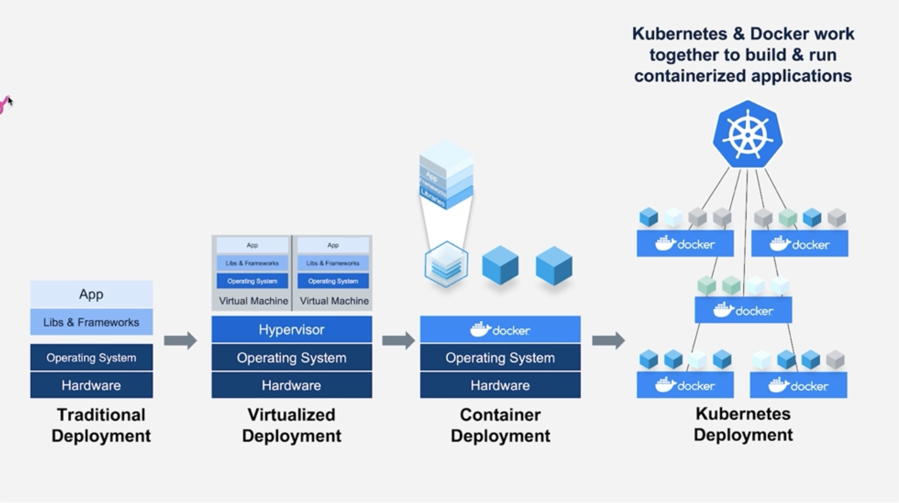
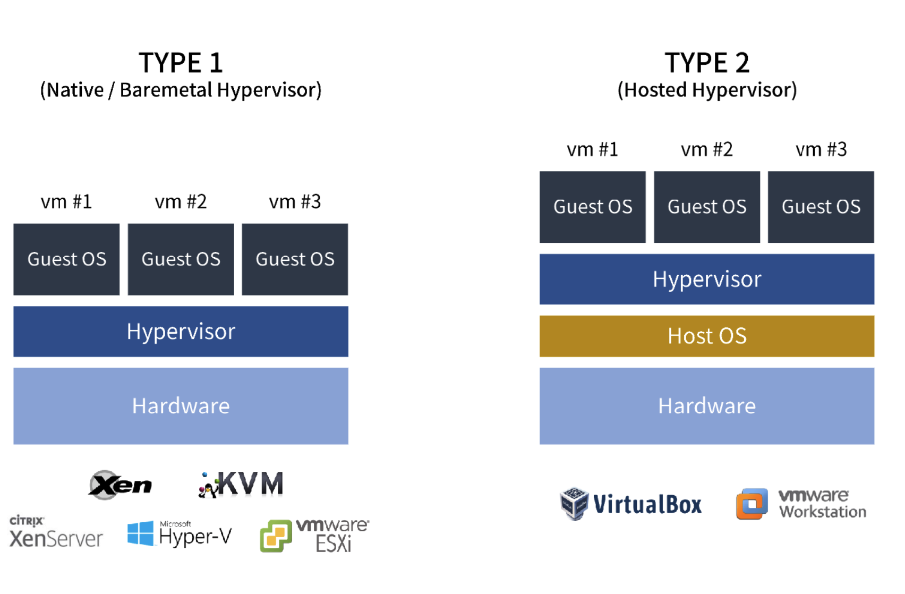
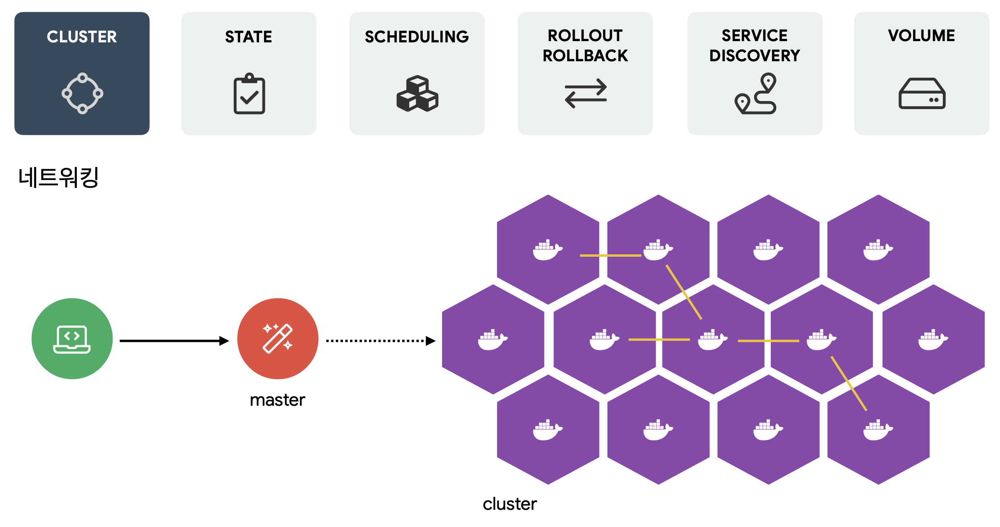
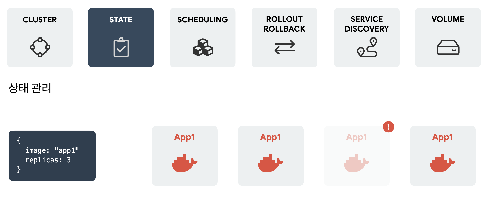
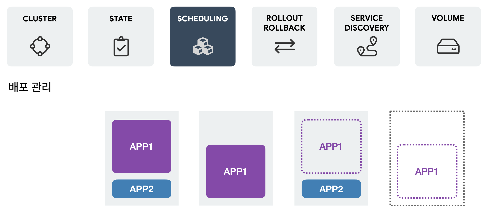
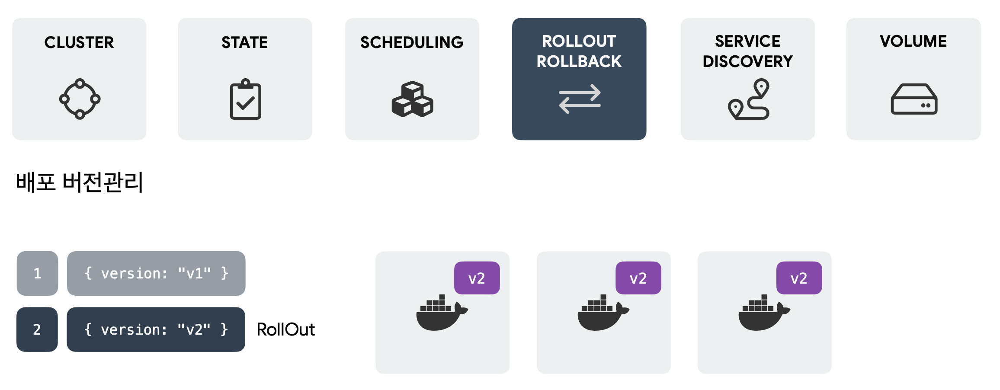
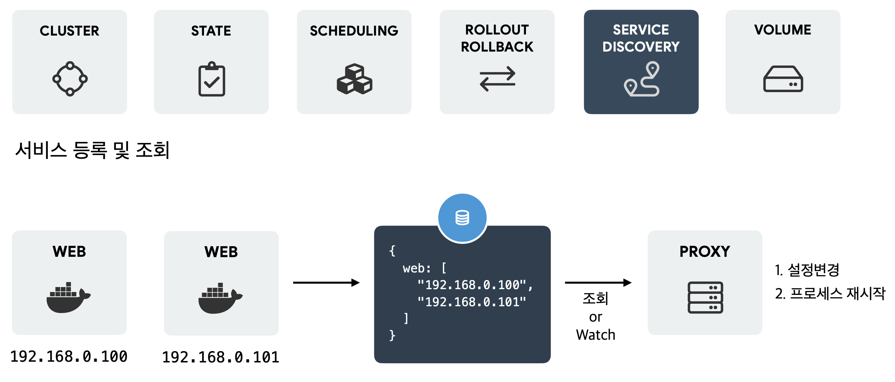
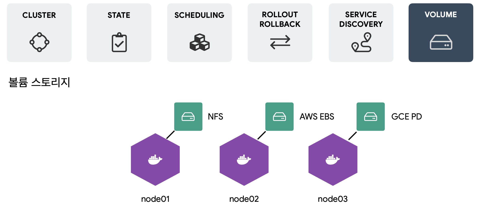
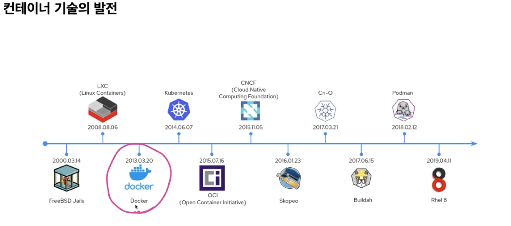

# 컨테이너 기술의 발전

Posted at 2022-03-02

---

***어떻게 (서비스를 효율적으로 운영할 것인지 / 컴퓨팅 자원을 최대한 잘 쓸 수 있는지)를 중심으로***

## 전통적인 서비스 배포 운영방식

- 애플리케이션이 OS 단위에 배포
  - 동일 물리 서버 내의 애플리케이션 간 공통의 라이브러리나 프레임워크의 의존성 문제로 잦은 충돌의 가능성이 존재한다.
- 애플리케이션 간 격리의 필요성 제기
  - 동일 물리 서버에서 여러 애플리케이션 리소스 한계를 정의할 방법이 없어, 리소스 할당의 문제가 발생
  - 동일 물리 서버에서 리소스를 과다하게 사용하는 인스턴스가 서버 내 다른 애플리케이션의 성능 저하를 유발
  - 서로 다른 여러 물리 서버에 각 애플리케이션을 실행하는 것은 리소스의 활용성이 극대화되지 못하며 과다한 유지 비용을 발생

### [가상화](https://github.com/AUSG/2021-Big-Chat/blob/main/20220207/AUSG%EB%B9%85%EC%B1%97_%ED%95%98%EC%9D%B4%ED%8D%BC%EB%B0%94%EC%9D%B4%EC%A0%80%EC%99%80%EA%B0%80%EC%83%81%ED%99%94_%EC%9A%B0%EC%88%98%EC%97%B0.pdf) 배포 운영방식

::: tip 가상화
- **물리적 하드웨어를 논리적으로 추상화** *(하나의 자원을 쪼개서 쓰거나, 여러 개의 자원을 하나인 것처럼 묶어서 사용 가능하도록 구성)*
:::

- 유휴 자원의 사용 효율성 증대, 분산 처리의 지원
- CPU / RAM / Storage / Network 등

::: tip 하이퍼바이저 (Hypervisor)
- 하드웨어와 가상 머신 (이하 Guest OS) 사이에서 매개체 역할 수행
- 실제 물리 자원을 가상화하여 Guest OS가 사용할 수 있도록 지원
:::

- Native(Baremetal) Hypervisor / Hosted Hypervisor 로 구분
    - **Type 1 | Native(Baremetal) Hypervisor**
        - *하드웨어에 직접 접근*하여 실행한다.
          - 하드웨어 리소스 관리가 유연함
          - Type 2 Hypervisor 대비 오버헤드가 적음
        - 자체적으로 머신에 대한 관리 기능이 없다.
          - 관리에 필요한 컴퓨터 혹은 CLI를 필요로 함
          - Type 2 Hypervisor 대비 사용성이 낮음
        - 전가상화 / 반가상화 – Type 1 가상화를 전제로 함
          - ::: tip 전가상화 (Full-Virtualization)
            - 하드웨어 전체를 가상화하는 방식
            - 하이퍼바이저를 가동하면 모든 가상 머신들의 하드웨어 접근이 DOM0(관리용 가상 머신)을 통해 이루어짐 (*모든 명령에 DOM0이 개입*)
            - Guest OS 운영체제의 별다른 수정이 필요 없음
            - *하이퍼바이저가 모든 명령을 중재하는 방식*으로 성능이 비교적 느림
            :::
          - ::: tip 반가상화 (Para-Virtualization)
              - 전가상화의 가장 큰 단점인 성능 저하 문제를 해결하기 위해 *Hyper Call 인터페이스를 통해 하이퍼바이저에 직접 요청 전달* 가능
              - 하이퍼바이저에게 Hyper Call 요청을 하기 위해 각 OS 커널을 수정해야 하며 오픈소스 OS가 아니라면 반가상화의 이용이 쉽지 않음
            :::

    - **Type 2 | Hosted Hypervisor**
        - *Host OS 위*에서 가상화한다.
        - Host OS - Hypervisor (e.g. VMware, VirtualBox, etc,.) - 가상의 하드웨어 에뮬레이팅 과정에 있어 오버헤드가 크다.
        - 가상의 하드웨어를 사용하여 Host OS에 큰 제약이 발생하지 않는다.

- 성능 효율성이 떨어짐
- *가상화를 위한 자원 오버헤드*가 높음

## 컨테이너 배포 운영방식

::: tip 컨테이너
- 모듈화되고 격리된 컴퓨팅 공간(환경)
- OS를 제외하고 애플리케이션 실행에 필요한 모든 파일을 패키징한 형태
- 구동 환경이 변경되어도 실행에 필요한 파일이 함께 따라다녀 오류 최소화
:::

- 컨테이너 단위로 애플리케이션이 실행
    - 가상 머신과 유사하나 *격리 속성을 완화*
    - 애플리케이션 간에 OS를 공유하므로 가벼움
        - 운영체제 위에서 하나의 애플리케이션이 동작하는 것과 동일한 수준의 컴퓨팅 자원 필요
        - 오버헤드가 적음
        - 컨테이너에서 실행 중인 서비스에 더 많은 가용성이 필요하거나 반대로 필요 없는 경우, CPU 사용량 혹은 사용자가 설정한 임계치에 따라 자동으로 확장 / 축소 가능
    - 기존 가상 머신과의 차이
        - 하드웨어 레벨 가상화가 아닌 **OS 레벨 가상화**
        - 컨테이너 엔진 (구현 기술 : 도커 등)으로 **애플리케이션 실행 환경 격리**
    - 속도가 빠르고 이미지 생성/공유가 쉬우며 단일 애플리케이션 구동을 위한 최소한의 환경만 구분한다.
    - 보안적으로 완전히 격리되지는 않으며 (*Host OS 커널 공유*) 가상머신 방식처럼 다양한 OS를 사용할 수 없다.

::: tip 도커 (Docker)
- _오픈 소스 기반의 컨테이너 관리 플랫폼_
- LXC 기술 기반
    - 기존 LXC 기술보다 이식성 향상
    - 데이터와 코드의 분산된 관리, 프로그램 스택의 간결함/명료함 등으로 이동성과 유연성 향상
    - 기존 시스템보다 더 쉽고 빠르게 워크로드 배포, 복제, 이동할 수 있으며 백업 가능
    - 컨테이너 이미지 생성 가능을 통해 특정 컨테이너에서 실행될 소프트웨어와 방식에 대해서 컨테이너 실행에 필요한 파일, 설정 값 등의 구동 사양을 미리 정의 가능
      - 개발자는 애플리케이션의 이미지를 만들고, 환경에 구애받지 않은 채 원격으로 배포하여 실행 가능
:::

## 컨테이너 오케스트레이션
  - 복잡한 컨테이너 환경을 효과적으로 관리하기 위한 도구
    - 관리하는 서버 컨테이너 수가 점점 증가하여 관리 문제 제기
  - 서버 관리자의 역할을 대신 할 프로그램을 만드는 도구
  ::: tip 쿠버네티스 (Kubernetes, a.k.a. k8s)
  - 컨테이너 오케스트레이션 도구로 복잡한 컨테이너 환경을 효과적으로 관리하기 위한 도구
  :::
  - 특징
    
    - Cluster
      - 중앙 제어
        - 이전에는 서로 다른 노드의 CPU / RAM 상태를 각각 관리
        - 노드 수가 증가하면 관리의 어려움이 있어 컨테이너 오케스트레이션에서는 합쳐서 추상화하여 클러스터 단위로 관리
      - 네트워킹
      - Node Scale
    
    
    - State
      - 트래픽이 증가해 서버를 새로 늘리거나, 하나의 서버에 장애가 발생했을 때를 감지하여 자동으로 서버를 늘려준다.
      - Auto Scaling
    
    
    - Scheduling
      - 자원 여유가 있는 서버에 알아서 적절하게 로드
    
    
    - Rollout / Rollback
      - 전체 컨테이너의 Rollout / Rollback을 중앙에서 관리
    
    
    - Service Discovery
      - 새로 등록된 서비스 IP, 변경된 IP를 자동으로 관리
    
    
    - Volume
      - 설정으로 각 서버에 필요한 스토리지 연결 가능 (NFS, AWS EBS, GCE PD 등)

---

