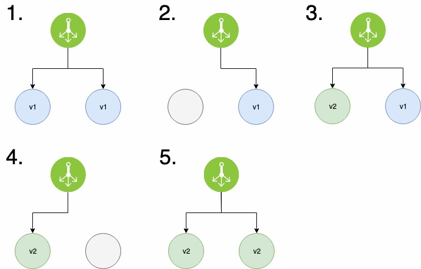
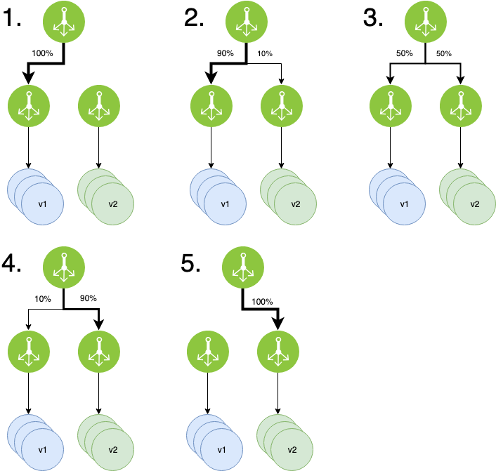
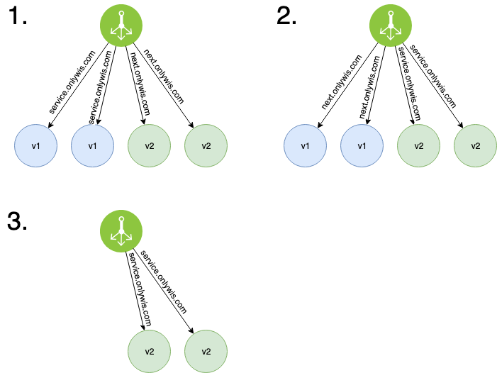

# 배포 전략

## Rolling

- 서버를 한 대씩 Old Version → New Version 으로 교체해 나가는 전략
- 서비스 중인 서버 한 대를 제외시키고 그 자리에 새 버전의 서버 추가
- 점진적(Gradual) 전환
- 서버 수의 제약이 있을 경우 유용하나 배포 중 인스턴스 수 감소하여 서버 처리 용량을 미리 고려할 필요가 있음

## Blue / Green

- 일괄적으로 Old Version → New Version 으로 전환하는 전략
- 구 버전 서버와 새 버전 서버를 동시에 나란히 구성하고 배포 시점이 되면 트래픽을 일제히 전환
- 하나의 버전만 프로덕션되므로 버전 관리 문제 방지, 빠른 롤백 가능
- 운영 환경에 영향을 주지 않고 실제 서비스 환경으로 새 버전 테스트가 가능
- e.g. 구 버전과 새 버전을 모두 구성하고 포트를 다르게 주거나 내부 트래픽일 경우 새 버전으로 접근하도록 설정하여 테스트 진행 가능
- 단, 시스템 리소스가 두 배로 필요하고, 전체 플랫폼에 대한 테스트 진행이 필요

## Canary

- 일산화탄소 및 유독가스에 매우 민감한 새 카나리아에서 비롯된 용어
- 위험을 빠르게 감지할 수 있는 배포 기법으로, Old Version, New Version 서버들을 구성하고 일부 트래픽을 새 버전으로 분산하여 오류 여부 판단
- A/B 테스트 가능, 오류율 및 성능 모니터링에 유용
- 트래픽을 분산시킬 라우팅은 랜덤으로 할 수도 있고 사용자 프로필 등을 기반으로 분류할 수도 있어
- 분산 후 결과에 따라 새 버전이 운영 환경을 대체할 수도 있고, 다시 구 버전으로 돌아갈 수도 있음
