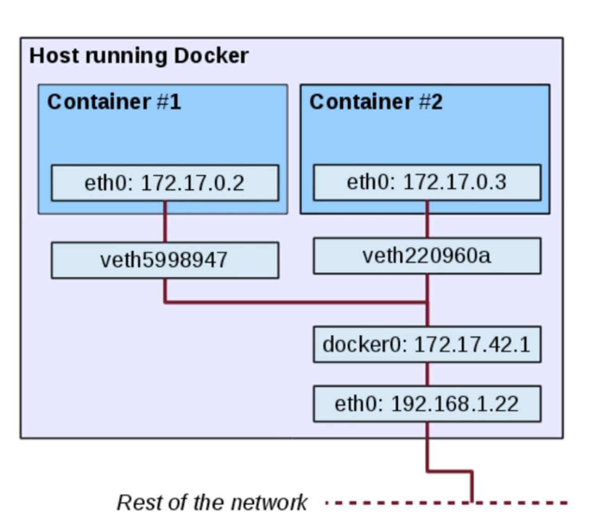
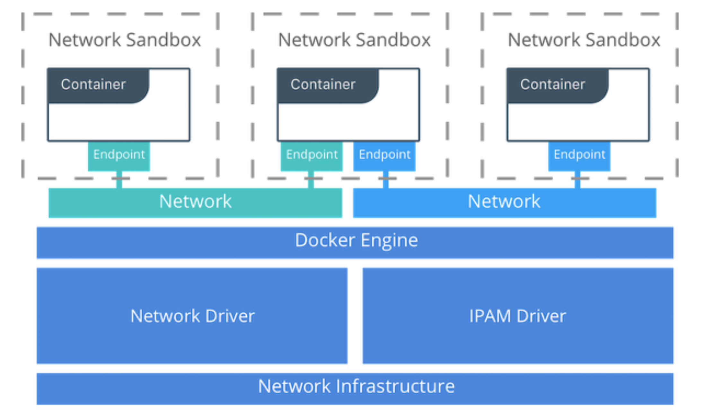
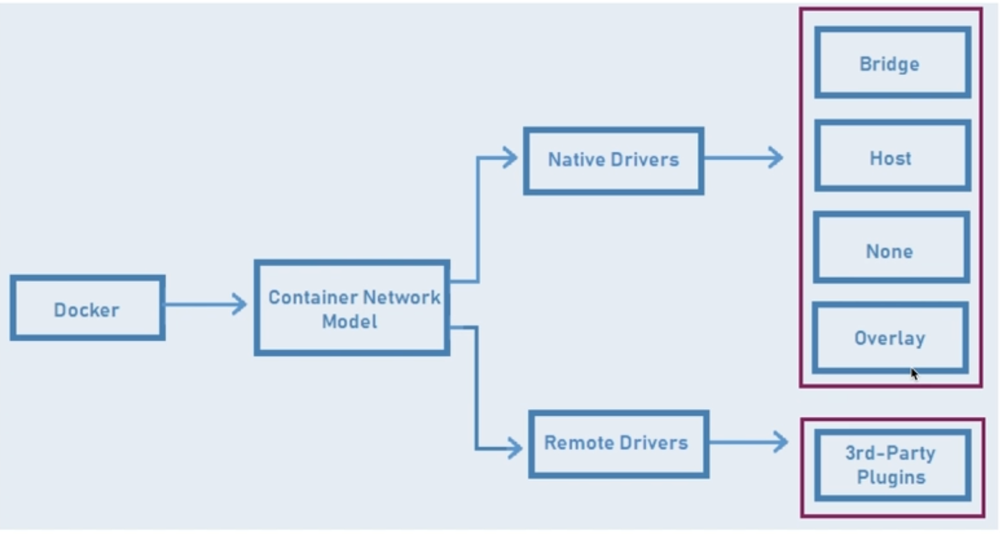
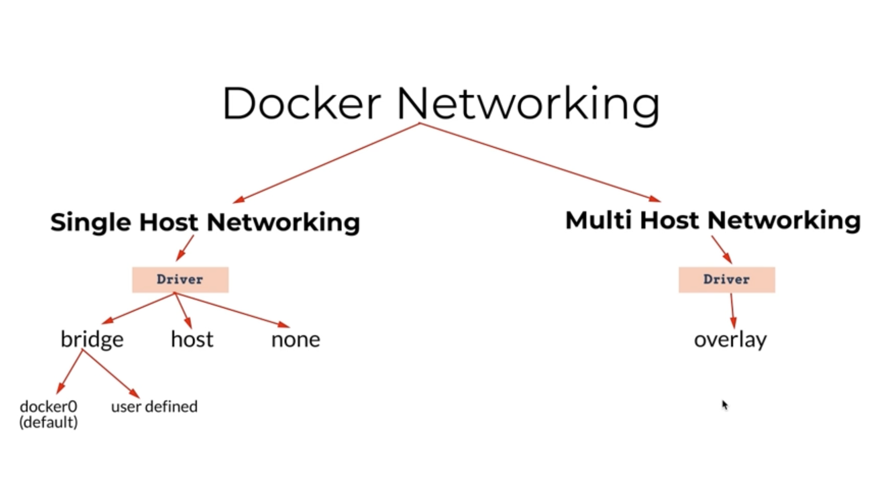

# 도커 네트워크 구조

---

- veth: Virtual Ethernet
- docker0: 도커 엔진에 의해 기본 생성되는 브릿지 네트워크
  - veth / eth 간 다리 역할

## Container Network Model

- Sandbox
  - Container의 Network Stack 구성 (e.g. Interface, Routing Table, DNS, etc,.)
  - 네트워크 물리 장비 역할
- Endpoint
  - Sandbox를 Network에 Attach
- Network
  - 서로 직접 통신 가능한 Endpoint 그룹
  - Linux Bridge, VLAN 등으로 구현

- Single Host Networking
  - Host
    - 하나의 도커 호스트에만 존재하며 같은 호스트에 존재하는 컨테이너 연결
    - Container와 Docker Host 간에 네트워크 Isolation을 제거하고 직접 호스트의 네트워킹 사용
  - Bridge
    - 802.1d Bridge (L2 Switch) 구현체
    - Container와 Application 간의 통신에 사용
  - None
    - 네트워킹이 필요없는 경우
- Multi-Host Networking
  - Overlay
    - 하나의 네트워크가 여러 호스트를 포함

---

## References
- [libnetwork Design](https://github.com/moby/libnetwork/blob/master/docs/design.md)