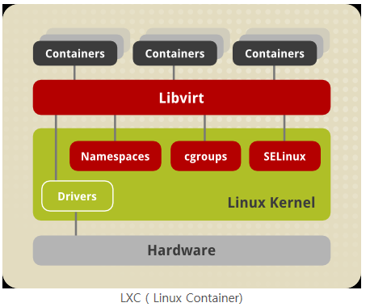
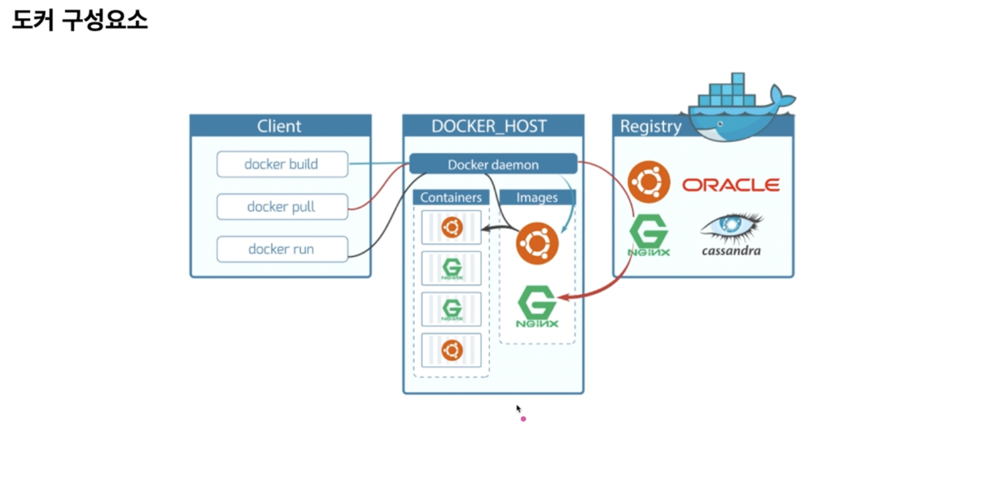
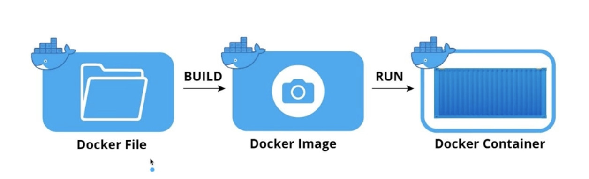
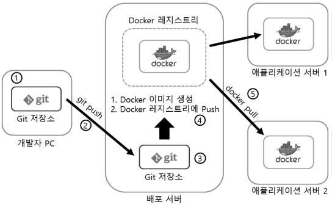
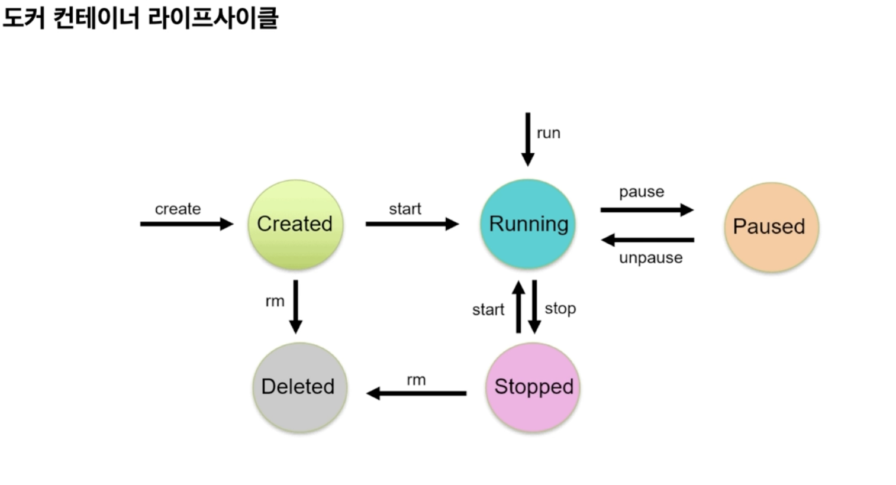
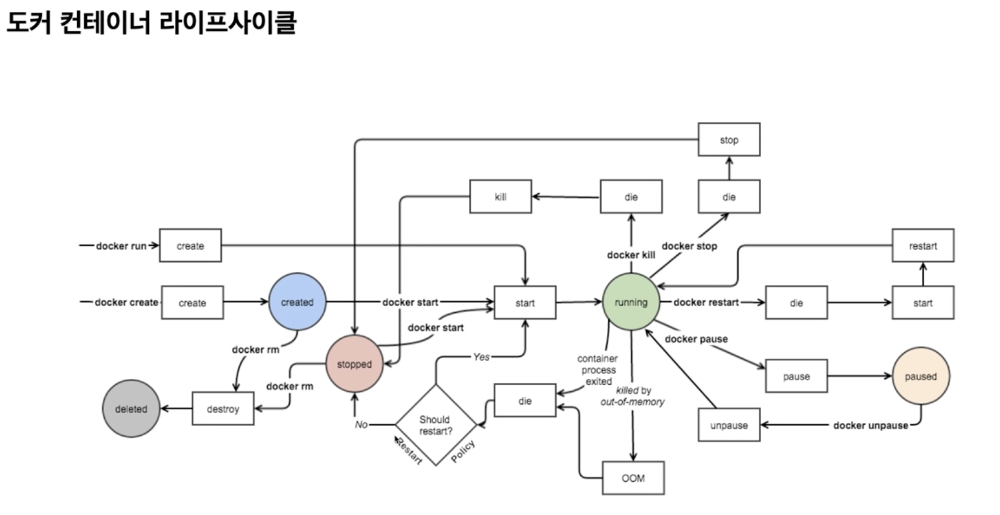

# Docker 

Posted at 2022-03-03

---


::: tip Docker
- _오픈 소스 기반의 컨테이너 관리 플랫폼_
- LXC 기술 기반
    - 기존 LXC 기술보다 이식성 향상
    - 데이터와 코드의 분산된 관리, 프로그램 스택의 간결함/명료함 등으로 이동성과 유연성 향상
    - 기존 시스템보다 더 쉽고 빠르게 워크로드 배포, 복제, 이동할 수 있으며 백업 가능
    - 컨테이너 이미지 생성 가능을 통해 특정 컨테이너에서 실행될 소프트웨어와 방식에 대해서 컨테이너 실행에 필요한 파일, 설정 값 등의 구동 사양을 미리 정의 가능
      - 개발자는 애플리케이션의 이미지를 만들고, 환경에 구애받지 않은 채 원격으로 배포하여 실행 가능
:::

> ### 도커 기반 기술
> 
> |기반기술|내용|
> |---|---|
> |cgroups|프로세스 그룹 리소스 제한 / 격리 / 모니터링|
> |namespace|프로세스, 네트워크 등 운영환경 고립|
> |libvirt|container에 공통으로 API를 제공하는 라이브러리|
> |container|애플리케이션이 수행되는 독립적인 공간|

## 도커 구성요소



|구분|구성요소|설명|
|---|---|---|
|Ship|Tarred Image|저장된 Image Tar 형태|
||Dockerfile|Image 생성 환경파일|
||Repository|Docker Image 저장소|
|Build|Images|응용프로그램 및 상태 패키지|
|Run|Container|도커 이미지 인스턴스 실행 공간|
||Networks|Host와 내부 컨테이너 간 연결|
||Volumes|컨테이너 수명주기와 독립적, 데이터 유지관리 공간|

## 도커의 기본 단위
- 이미지 (Image)
  - 컨테이너 생성에 필요한 요소
  - 컨테이너 목적에 맞는 바이너리, 의존성이 설치되어 있음
  - 여러 Layer로 구성된 바이너리 파일로 존재
- 컨테이너 (Container)
  - 호스트와 다른 컨테이너로부터 격리된 시스템 자원과 네트워크를 사용하는 프로세스
  - 이미지는 읽기 전용으로 사용하여 변경사항은 컨테이너 계층에 저장
    - 컨테이너에서 무엇을 하든 이미지는 영향을 받지 않음
- 이미지 : 컨테이너 = 1 : N 관계


## 도커 이미지 구성
- `repositoryName/imageName:imageTag`
- e.g. `nginx:1.21.6-alpine` 
- 저장소 이름 생략 가능 (생략할 경우 기본 저장소 docker hub로 인식)
- 이미지 태그 생략 가능 (최신 리비전 latest 지정)

## 이미지 저장소
- 도커 이미지를 관리하고 공유하기 위한 서버 애플리케이션
- 공개형과 비공개형으로 나뉨 (public / private) 

## 도커 컨테이너 배포 절차


|단계|설명|
|---|---|
|개발|애플리케이션 개발|
|Repository 배포|배포서버에 소스 업로드|
|Registry 배포|배포서버에 소스 저장 (배포)|
|Image 생성|Docker Image 생성 후 Registry 등록|
|Container 생성|Docker Image 다운로드 및 실행|

## Lifecycle



## Commands

- 컨테이너 생성

```
$ docker create [image]
```

- 컨테이너 시작

```
$ docker start [image]
```

- 컨테이너 생성 및 시작

```
$ docker run [image]
```

## [CheatSheet](https://www.docker.com/sites/default/files/d8/2019-09/docker-cheat-sheet.pdf)

### References

- [도커(Docker)](http://blog.skby.net/%EB%8F%84%EC%BB%A4docker/)