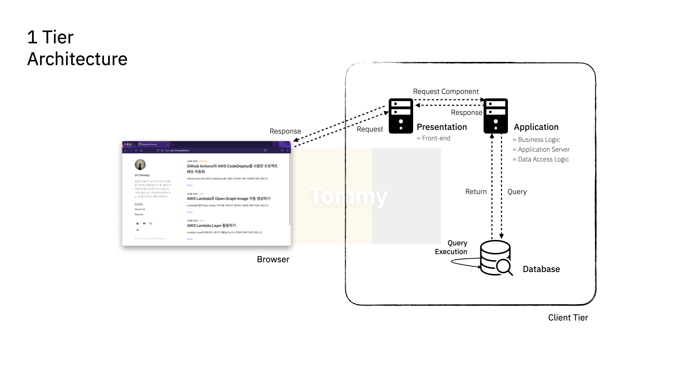
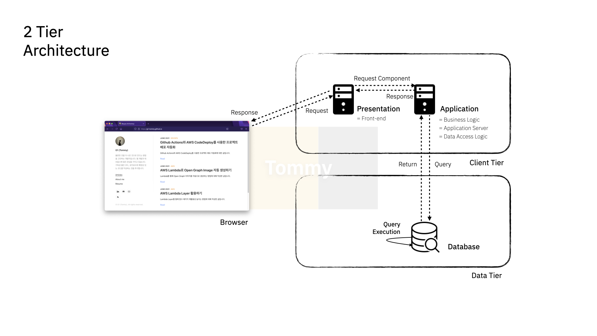
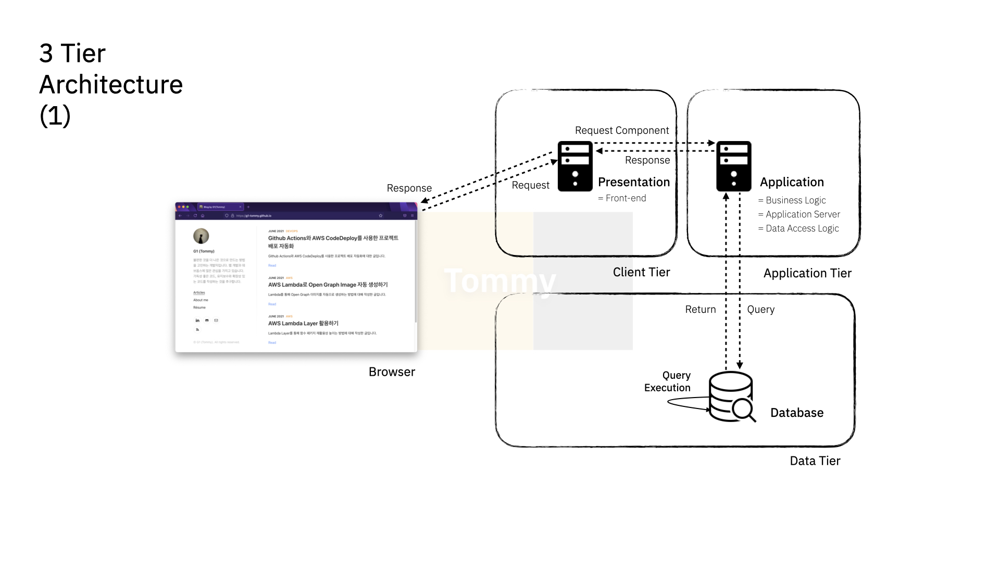
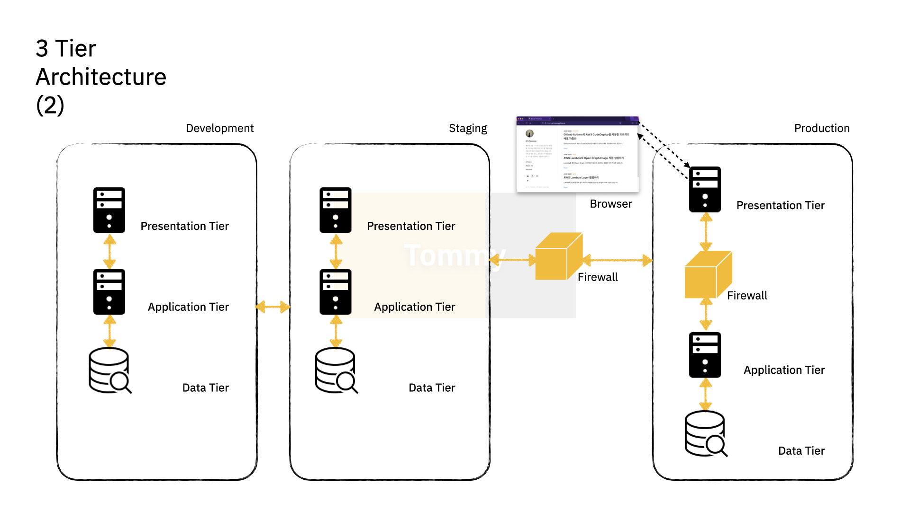

# Multi-Tier Architecture

Posted at 2021-06-29

> 플랫폼을 다수 계층으로 나누어 별도의 물리적(Physical) / 논리적(Logical) 장치에 구축, 운영하는 형태

일반적으로 3-Tier (Presentation / Application / Data) 형태로 운용되는 경우가 많으며, 상황에 따라 더 많은 계층을 두거나 반대의 경우도 존재함

## Presentation Tier

User Interface (UI)를 지원 - `Front-end`, 사용자와 직접 마주하는 계층

e.g. `HTML`, `Javascript`, `CSS`, Image Assets, etc,.

## Application Tier

특정 규칙으로 바탕으로 하는 요청 정보의 가공 --> 동적 데이터 제공

== Business Logic / Transaction Tier

`Client Tier` 측면에서의 Application Tier는 서버와 같이 동작 (Response), `Data Tier` 측면에서의 Application Tier는 클라이언트와 같이 동작 (Request)

--> `Middleware` or `Back-end`

e.g. `PHP`, `Java`

## Data Tier

Database에 접근에 데이터를 읽고 쓰는 것을 관리함

Data Tier 또한 Back-end로 볼 수 있음

e.g. `DBMS` --> `MySQL`, `MongoDB`, etc,.

## 1-Tier

하나의 물리적 서버 (컴퓨터)에 3가지 다른 기능을 함께 구현, 물리적 장비 변경 시 모든 구성의 변경 필요

## 2-Tier

`Client Tier`와 `Data Tier`의 물리적 구분 --> 각 계층에서의 변경은 서로에 영향을 받지 않음

클라이언트에 모든 로직이 존재하기 때문에 `재사용성` 측면에서 _바람직하지 못함_, `자원 활용` 측면에서도 _비효율적_이며 `모니터링 및 관리`가 _용이하지 못함_

## 3-Tier (1)

각 계층 모두 물리적인 구분으로 구성 --> 각 계층에서의 변화는 서로 영향 없이 독립적으로 운영

## 3-Tier (2)

`Development` / `Staging` / `Production` 형태로, `Development` 단계에서는 서비스 / 기능 구현 후 `Staging` 단계에서 자체 테스트를 거친다. 이상이 없는 경우 `Production` 단계로 Migration 하여 서비스하는 형태 --> 각 단계는 `백업`하는 구성일 뿐 아니라 각 기능 혹은 서비스에 대한 테스트를 거치고 업데이트 하는 `버전 관리 구성`도 가능

## Pros and Cons of Implementing 3-Tier Architecture

- 장점

    - 물리적 (혹은 논리적) 서버 구성을 통한 리스크 완화 --> `백업 구성`이나 `이중화` 등의 가능

    - 여러 대의 서버로 나누어 계층 동작 --> 서버 부하 감소

    - 경우에 따른 서버 `Scale-up` 고려 가능

    - 계층별 업무 분담으로 효율성 증가

- 단점

    - 관리의 복잡도 상승

    - 장애 발생 포인트 증가

    - 서비스 규모와 사용자 규모에 따른 비용 고려 필요
