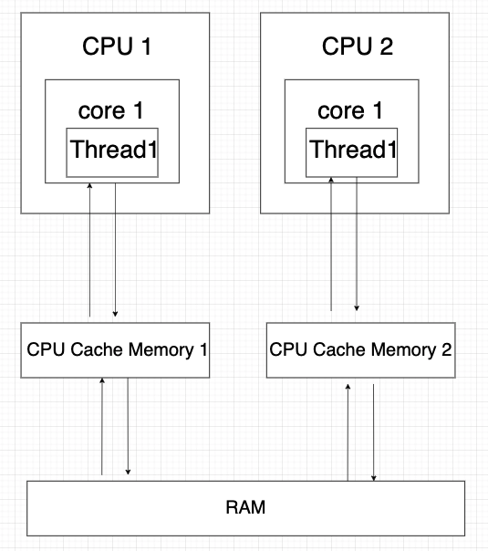

# 멀티 스레드 환경에서의 동시성 보장

자바 메모리 구조는 CPU - RAM 아키텍처 기반으로 다음과 같이 동작합니다.



- CPU가 작업 처리를 위해 필요한 데이터를 RAM에서 읽어 CPU Cache에 복제
- 작업 처리 후 변경된 CPU Cache 데이터를 RAM에 overwrite

CPU가 여러 개인 경우 CPU별로 Cache에 저장된 데이터가 달라 문제가 발생할 수 있습니다.

## 가시성
- 하나의 스레드에서 공유 자원 (변수 / 객체 등)을 수정한 결과가 다른 스레드에게 보이지 않을 경우 발생
```java
public class Main {
    private static boolean stopRequested; 

    public static void main(String[] args) throws InterruptedException {
        Thread background = new Thread(() -> {
            for (int i = 0; !stopRequested ; i++); 
            System.out.println("Ended Background Thread");
        });
        
        background.start(); // (A)

        TimeUnit.SECONDS.sleep(1);
        stopRequested = true; // (B)
        System.out.println("Ended Main Thread");
    }
}
```

백그라운드 스레드는 메인 스레드와 다른 CPU 캐시에 stopRequested 리소스를 복제하고, 이후 복제한 값을 사용해 조건식을 반복해서 실행합니다.
1초 이후 메인 스레드에서 boolean 값을 변경하지만 다른 CPU 캐시를 참조하므로 메인 스레드에서 일어난 변경을 알아채지 못합니다.
따라서 메인 스레드는 종료되어도 백그라운드 스레드는 alive 합니다.

## 동시 접근
- 여러 스레드에서 공유 자원을 동시에 접근했을 때 연산이 가장 늦게 끝난 결과값으로 overwrite되는 문제
```java
public class Main {
    private static int t;

    public static void main(String[] args) throws InterruptedException {
        for (int i = 0; i < 100; i++) {
            new Thread(() -> {
                for (int j = 0; j < 1000; j++)
                    System.out.println(t++);
            }).start();
        }
    }
}
```

코드 상으로 보았을 때 1 ~ 100 * 1000만큼 순차적으로 출력할 것처럼 보여지지만, 여러 스레드에서 공유자원에 접근해 값을 바꾸므로 순서 보장이 되지 않아 의도와 다른 결과가 출력됩니다.

## 동시성 보장 방법
- `volatile` keyword
    - 가시성 문제는 해결되지만, 동시 접근 문제는 여전히 존재합니다.
    - 해당 키워드가 붙은 리소스는 Read와 Write를 CPU Cache가 아닌 메인 메모리에서 동작, 즉 자원을 저장하는 메모리가 하나가 되기 때문에 같은 공유 자원에 대해 메모리별로 다른 값을 가지는 경우는 없습니다.
    - 여러 스레드에서 메인 메모리의 공유 자원에 동시 접근 가능하기 때문에 여러 스레드에서 값을 수정하려고 시도하면 값이 overwrite 될 수 있어 동시 접근 문제 해결이 불가합니다.
- `synchronized` keyword
    - 안전하게 동시성 보장이 가능하지만 가장 비용이 비쌉니다.
- `AtomicReference<V>` class
    - compare-and-swap 알고리즘을 사용하여 가장 저렴한 비용으로 동시성을 보장합니다.
    - 현재 스레드가 존재하는 CPU 캐시와 메인 메모리 저장 값을 비교해 일치하는 경우 새로운 값으로 교체하고, 그렇지 않을 경우 기존 교체가 실패되어 Retry하는 방식입니다.
    - CPU가 메인 메모리 리소스를 CPU 캐시로 가져와 연산을 수행하는 동안 다른 스레드에서 연산이 수행돼, 메인 메모리 자원 값이 변경될 경우 기존 연산을 실패 처리하고, 새로 바뀐 메인 메모리 값으로 재수행합니다.

```java
AtomicReference<Integer> atomic = new AtomicReference<>();
System.out.println("atomic : " + atomic.get());									// null

AtomicReference<Integer> atomic2 = new AtomicReference<>(100);
System.out.println("atomic2 : " + atomic2.get());								// 100

AtomicReference<Integer> atomic3 = new AtomicReference(10);
System.out.println("Value before setting : " + atomic3.getAndSet(20));	// 10
System.out.println("Value after setting : " + atomic3.get());						// 20

int expected = 20;
AtomicReference<Integer> atomic4 = new AtomicReference<>(10);
System.out.println("Success ? " + atomic4.compareAndSet(expected, 100));	// false
System.out.println("Value : " + atmoic4.get());														// 10

atomic4.set(20);
System.out.println("Success ? " + atomic4.compareAndSet(expected, 100));	// true
System.out.println("Value : " + atmoic4.get());														// 100
```