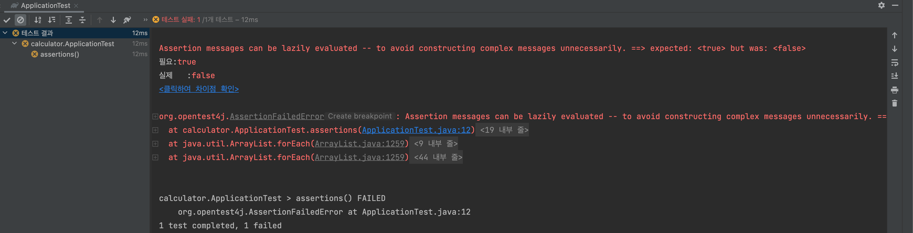
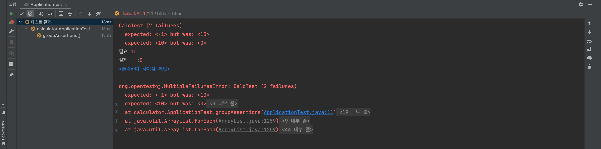
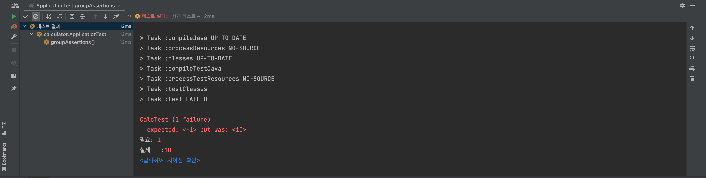
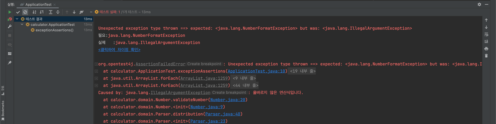

# JUnit5 Assertions & Assumptions

Posted at 2022-01-22
---

## Assertions

> 단정문, **성공하지 않을 때 실패 처리하기 위해 사용**

- `JUnit5`에서는 `JUnit4`에서 사용하지 못한 `Java 8의 람다 표현식` 사용이 가능함에 따라, 테스트 코드를 보다 **Functional**하게 작성할 수 있다.

Using `org.junit.jupiter.api.Assertions`

### Message

```java
/**
Calculator -> String expression을 받아 expression result 출력
이 때, 사칙연산의 우선순위를 적용하지 않고, 입력받는 operand를 순차적으로 연산함
*/
@Test
void assertions() {
    assertEquals(10, new Calculator("2 + 3 * 4 / 2").value());
    assertTrue(1 > 5, () -> "Assertion messages can be lazily evaluated -- to avoid constructing complex messages unnecessarily.");
}
```



- assertion에 대한 메시지를 붙일 수 있다. 실패하면 지정한 메시지를 출력할 수 있다.

### Group

- JUnit5에서 추가된 것으로, **동시에 Assertion 구문을 실행시킬 수 있는 그룹**을 만들 수 있다.
- assertion 메서드와 람다식의 조합으로 **병행 실행**을 구현할 수 있다.

```java
@Test
void groupAssertions() {
    assertAll("CalcTest",
        () -> assertEquals(10, new Calculator("2 + 3 * 4 / 2").value()),
        () -> assertEquals(0, new Calculator("2 + 3 * 4 - 20").value())
    );
}
```



- 두 구문이 모두 실패하였을 경우 위의 이미지와 같이 두 구문에 대한 실패 메시지를 출력한다.



- 두 구문 중 하나가 실패하였을 경우 위의 이미지와 같이 한 구문에 대한 실패 메시지를 출력한다.

### Exceptions

- `JUnit4`에서는 Exception 테스트를 위해 `@Test(expected = <ExceptionClass>)` 와 같이 `Annotation`을 통해 확인할 수 있었으나, 이러한 테스트는 Exception 발생 지점을 정확하게 파악하기 힘든 단점이 있다.
- `JUnit5`에서는 `assertThrows`, `assertThatThrownBy` 등의 메서드를 활용해서 exception 테스트가 가능하다. **exception이 발생할 수 있는 부분을 람다 표현식으로 감싸서 exception이 발생하는 지점을 특정하여 테스트가 가능하다.**

```java
/**
Calculator의 constructor에 argument로 expression을 입력받는다.
이 때, 정상적인 expression이 아닐 경우 IllegalArgumentException을 throw하도록 설계하였다.
*/
@Test
void exceptionAssertions() {
    // 아래의 경우 IllegalArgumentException이 발생하며 NumberFormatException은 발생하지 않는다.
    Exception exception = assertThrows(NumberFormatException.class,
        () -> new Calculator("+ + / 3").value());
}
```



```java
/**
0으로 나누는 경우에도 IllegalArgumentException을 throw한다.
*/
@DisplayName("0으로 나누었을 때 에러 검증")
@Test
void errorWhenDivideByZero() {
    assertThatThrownBy(() -> new Calculator("2 / 0 + 5 * 3").value())
        .isInstanceOf(IllegalArgumentException.class);
}
```

### timeout

- `JUnit4`에서는 `@Test(timeout=<seconds>`를 통해 타임아웃을 지정한다. 위의 exception 케이스와 마찬가지로 이런 경우 Exception 발생 지점을 정확하게 파악하기 힘든 단점이 있다.
- `JUnit5`에서 `assertTimeout` 메서드를 활용해 문제를 해결할 수 있다. 해당 메서드는 반환값을 가져 추후 활용이 가능하다.

```java
/**
ofMinutes(Duration timeout)에서 정의한 시간 내에 실행이 완료되지 않으면 테스트를 실패시킨다.*/
@Test
void timeoutNotExceed() {
    // The following assertion succeeds.
    assertTimeout(ofMinutes(2), () -> {
        // Perform task that takes less than 2 minutes.
    });
}

@Test
void timeoutNotExceededWithResultMessage() {
    // The following assertion succeeds, and returns the supplied object.
    String actualResult = assertTimeout(ofMinutes(2), () -> {
        return "Result Message";
    });
    assertEquals("Result Message", actualResult);
}
```

---

## Assumptions

> 가정문, **특정 조건에서만 테스트를 실행하고자 할 때, 또한 반대로 특정 상황에서만 실행하지 않고자 할 때 사용**

`org.junit.jupiter.api.Assumptions`

### Basics
```java
private final String environment = "local";

@Test
void testOnLocal() {
    assumeTrue("local".equals(environment),
        () -> "Aborting test: not on developer workstation"
    );

    assertThat(new Calculator("2 + 3 * 4 / 2").value()).isEqualTo(10);
}
```

- 위의 코드는 실행 환경이 `local`인 경우에만 `assumeTrue`에서 `true`로 인지하여 아래 `assertThat` 구문을 실행하며, `assumeTrue`가 통과되지 않으면 **해당 테스트 메서드는 실패가 아닌 `ignored` 처리된다. (`@Disabled`)**

### Applications

- `assumingThat` 구문을 사용하면 보다 복잡한 assumptions 구현이 가능하다.

```java
private final String environment = "development";

@Test
void testInAllEnvironments() {
    assumingThat("development".equals(environment),
        () -> {
            System.out.println("In development mode");
            assertEquals(2, new Calculator("4 / 2").value());
        });

    System.out.println("Etc Environment");
    assertEquals(30, new Calculator("6 * 5").value());
}
```

- `assumingThat`의 **첫번째 인자가 true인 경우, 다음 함수형 파라미터가 실행**된다.

## References

- [StackOverflow](https://stackoverflow.com/questions/44628483/assume-vs-assert-in-junit-tests)
