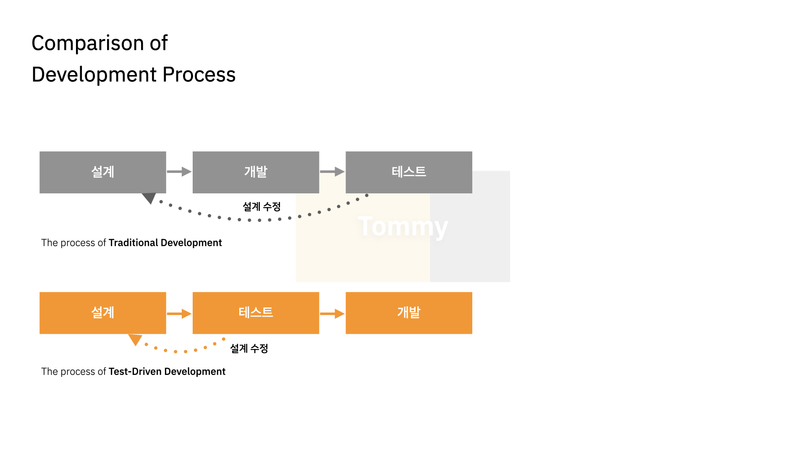
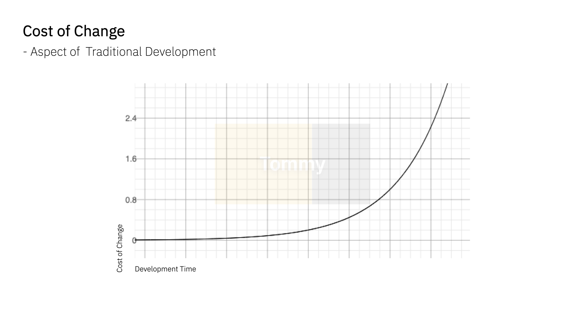
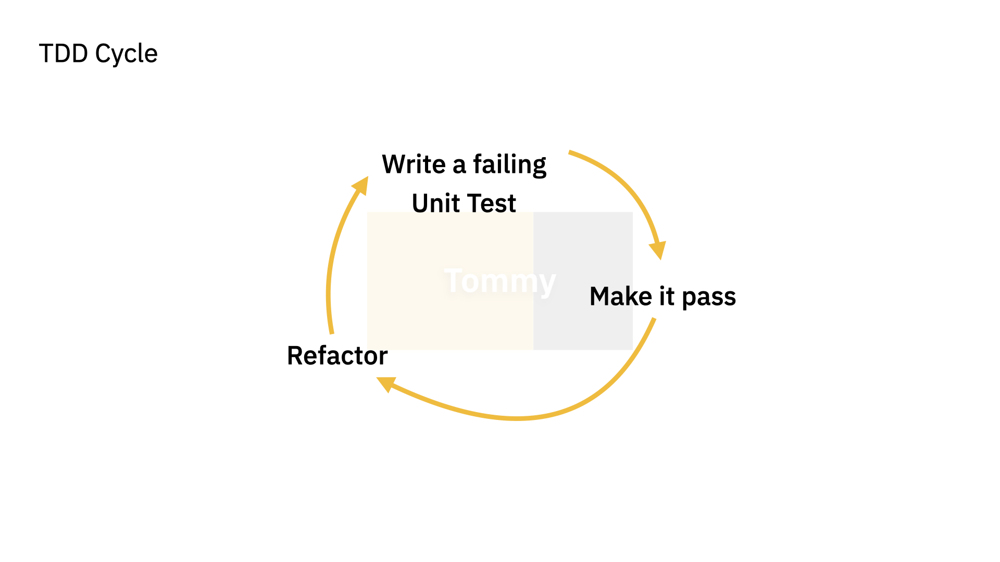

# TDD Overview

---

> Test-Driven Development
> 테스트가 개발을 이끌어나간다.

매우 짧은 개발 사이클을 반복하는 소프트웨어 개발 프로세스 중 하나. 프로젝트를 개발하는 과정에서 기능 개발보다 테스트 작성을 우선시하고, 이러한 테스트 코드의 반복으로 기능의 정상적인 동작 여부 피드백을 적극적으로 받는 것.

## 장점

- 객체지향적 (Object-oriented) 코드 개발
    - 명확한 기능과 구조를 설계할 수 있다.
    - 각 함수와 기능에 대해 철저히 구조화하여 코드 작성이 가능하다.
    --> 테스트 용이성을 위한 복잡한 기능을 한 함수에 모두 구현하면 테스트 방식이 복잡해지고 오래 걸리며, 코드 수정 시 테스트 코드의 재사용이 어렵기 때문
    --> 모든 코드가 재사용성을 바탕으로 작성되어야하기 때문에 보다 `객체지향`적인 코드가 됨

- 설계 수정 시간의 단축
    - 테스트 코드가 먼저 작성되기 때문에, 최초의 설계를 만족하며 입출력 구조와 기능의 정의를 명확히 하므로 설계의 구조적 문제를 파악할 수 잇음.
    - 결함을 일찍 파악할 수록 수정에 필요한 기대비용이 감축된다.

    

- 디버깅 시간 단축
    - 단위 테스트 기반의 테스트 코드 작성은 향후 문제 발생 시 문제의 지점을 쉽게 파악 가능

    > 문제가 발생할 수 있는 지점은 데이터베이스 영역, 애플리케이션 영역, 데이터 영역, 메모리 영역 등 다양하기 때문에 통합 테스트는 문제의 지점을 파악하는 데 어려운 요소로 작용함

    

- 유지보수 용이성
    - 테스트 요소가 기술적 관점이 아닌 사용자 관점으로 정의되고 진행되어 입출력 흐름이 명확해지고, 추후 구조 변경이나 소스 수정 시 구조의 빠른 파악과 수정이 가능함. 재사용 테스트 또한 쉽게 가능
    
    > 기술적 관점은 기능 자체의 실현에 목적을 두기에 코드가 복잡해지고 테스트가 어려워짐

- 테스트 문서 대체 가능
    - 테스팅의 자동화는 물론 정확한 테스트 근거 산출 가능

